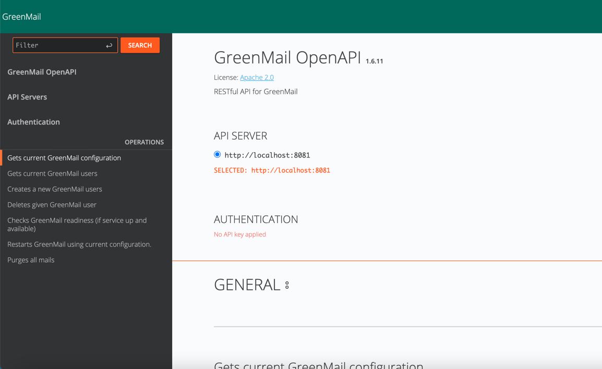
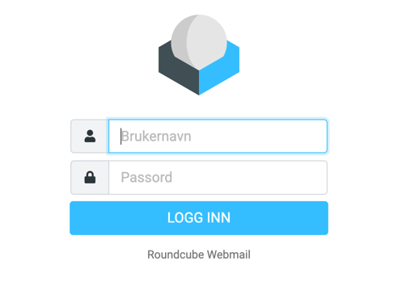
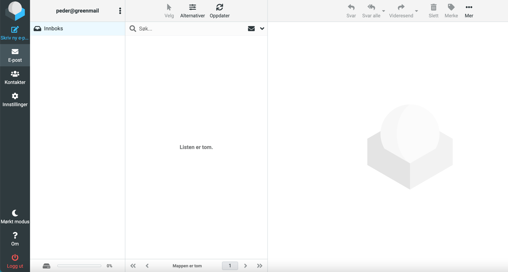
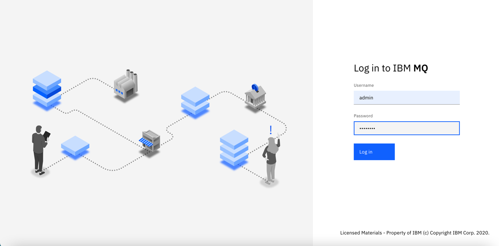
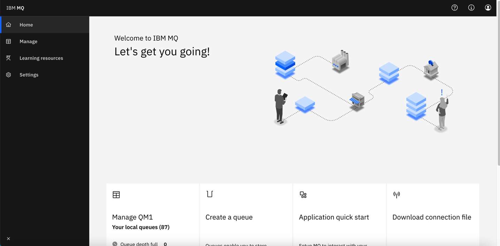

# lokalt utviklingsmiljø

Målet er å være i tråd med spesifikasjon fra e-helse:
["Basert på ebXML"](https://git.sarepta.ehelse.no/publisert/standarder/raw/master/kravdokument/EBXMLrammeverk/HIS%201037_2011%20Rammeverk%20for%20meldingsutveksling%20v1.1%20-oppdatert.pdf)
og ["Validering av
ebXML-meldinger"](https://git.sarepta.ehelse.no/publisert/standarder/raw/master/kravdokument/ValideringAvebXMLMeldinger/HITS%201172_2017%20Validering%20av%20ebXML-meldinger%20-oppdatert.pdf)

For CPP/CPA implementasjon se:  ["Profil for CPP/CPA"](https://www.ehelse.no/standardisering/standarder/profil-for-cpp-cpa--partnerprofiler-og-avtaler/_/attachment/inline/8ff59f07-70be-459a-a644-6b11451d1dc2:b47b3b4b5740def9e91c0cd2795c872dd4196d3c/Profil%20for%20CPP%20CPA%20%E2%80%93%20partnerprofiler%20og%20avtaler.pdf)

Se også Oasis ["ebMS 2.0 Spec"](https://www.oasis-open.org/committees/ebxml-msg/documents/ebMS_v2_0.pdf)
og Oasis ["CPPA Specification 2.0"](https://www.oasis-open.org/committees/ebxml-cppa/documents/ebcpp-2.0.pdf)

## Start opp docker:
```
docker-compose up -d
```
## Containers:
### Epostserver: greenmail
* http://localhost:8081/
  

### Epostklient: roundcube
* http://localhost:8000/
* user/pass: peder@epost.com/peder
* user/pass: thomas@epost.com/thomas
  
  

### MQ
https://localhost:9443/ibmmq/console/
* user/pass: admin/passw0rd
  
  


